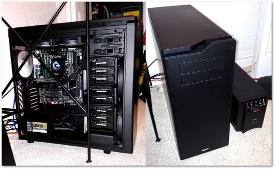

# Dotfiles

This project uses a configuration management framework called
[salt](https://docs.saltstack.com/en/latest/) to coordinate installation and
configuration of tools for my personal desktop/workstation.



---

## Configuration

The salt state system uses the sls files as a representation of the state in
which the system should be in.

These states make use of two custom grains

**/etc/salt/grains:**

```
user: evan
homedir: /home/evan
```

a pillar for the ssh identity files in ssh/init.sls

**/srv/pillar/dotfiles/ssh/init.sls:**

```
.ssh/bitbucket/id_rsa: {{ identity }}
.ssh/github/id_rsa: {{ identity }}
.ssh/visualstudio/id_rsa: {{ identity }}
```

**/srv/pillar/top.sls:**

```
base:
  '*':
    - dotfiles.ssh
```

## Thanks

This project was inspired by:

[saltstack-dotfiles](https://github.com/rawkode/saltstack-dotfiles)

[salt-states](https://github.com/shadowfax-chc/salt-states)

[gentoo-packer](https://github.com/d11wtq/gentoo-packer)

Many thanks to all the contributors of these projects.
