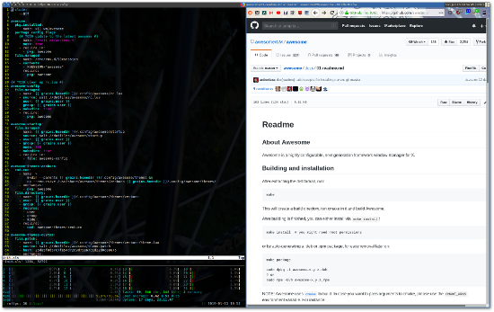

# Awesome

Window manager for X

Desktop screenshot showing
[awesome](https://awesomewm.org),
[tmux](https://github.com/tmux/tmux),
[vim](https://www.vim.org),
[htop](https://github.com/hishamhm/htop), and
[firefox](https://firefox.com)

